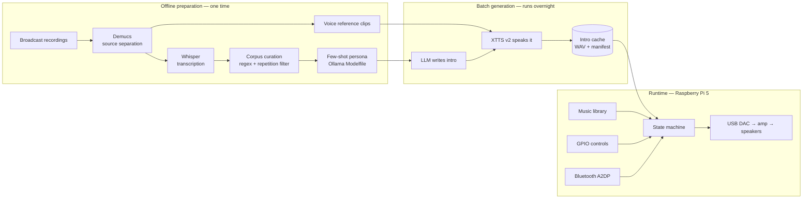

# Casey Radio

An offline AI radio host for a Raspberry Pi 5. A local language model writes song
introductions in the style of a classic countdown DJ, a local text-to-speech model
speaks them in a cloned voice, and a state machine interleaves them with music from
a local library — all on-device, with no network connection and no API keys.

Built as a hardware/software systems exercise: edge inference on constrained
compute, a real-time audio path, and a GPIO control surface, packaged as an
appliance that boots into a single job.



---

## What it does

Three modes, selected by physical toggle switches:

| Mode | Behaviour |
|---|---|
| **Library + narration** | Plays a shuffled playlist. Before each track, a cached intro plays in the cloned host voice. |
| **Library only** | Same music, narration suppressed. Switchable mid-playback. |
| **Bluetooth** | Hands the sound card to a BlueALSA bridge so a phone can play through the same speakers. |

A rotary encoder selects between playlists; three pushbuttons handle transport.

---

## Why it was interesting to build

The parts worth reading the code for.

### Hardware abstraction with a mock backend

`controls.py` defines an interface — *is the source switch on Bluetooth, is
narration enabled, was a button pressed* — and provides two implementations of it.
One reads GPIO through `gpiozero`; the other reads keystrokes.

The state machine never learns which one it received. That makes the entire system
testable on a laptop with no hardware attached, and it meant the control logic was
written and debugged before a single wire was cut. When the panel was built,
nothing in `radio.py` changed.

This is standard practice in embedded and robotics work and it pays for itself
immediately: when a fault appears after the hardware is connected, it is
unambiguously electrical, because the software half was already proven.

### Real-time constraints in the audio path

The playback callback in `audio.py` runs on a driver-owned thread against a hard
deadline — a new block of samples every ~46 ms, indefinitely. Miss it and the card
emits whatever was in the buffer, which is an audible click that cannot be undone
after the fact.

So the callback performs no allocation, no I/O, no logging, and takes no locks.
Anything with unbounded duration is hoisted out of it. This is the same discipline
an interrupt handler or a motor control loop requires, and the reasoning transfers
directly: correctness depends not only on producing the right value but on
producing it before a deadline.

### Moving expensive work out of the latency-critical path

Speech synthesis on a Pi 5 CPU runs roughly 8–20× slower than real time. Generating
an introduction on demand would stall playback for minutes.

Because the music library is known in advance, generation became a batch job.
`generate_intros.py` walks the library, synthesises every intro once, and writes
them to a content-addressed cache keyed on a hash of artist and title. At runtime,
narration is a file read.

The side benefits turned out to matter as much as the speed: every generated line
is stored as text in `manifest.json`, so the whole batch can be reviewed before it
is ever heard, and identical input always produces identical output — which makes
A/B comparison of voice settings meaningful.

### One owner per exclusive resource

An earlier prototype mixed two playback mechanisms and produced intermittent
distortion whenever both touched the sound card at once. The fix was structural
rather than a patch: all device access was concentrated in a single `Player` class,
and the Bluetooth mode explicitly releases the device before handing it to the
external bridge.

The same failure shape appears with serial ports, GPIO lines, and file handles.
Deciding who owns a resource is cheaper than debugging contention for it.

### Edge inference under a real memory budget

A quantised 8B language model is ~5 GB resident and the TTS model ~2 GB, against
8 GB of system RAM shared with the OS. Rather than accept an unreliable margin, the
system uses a 3B model for text generation and relies on the cache design to ensure
generation and playback never run simultaneously.

---

## Hardware

| Component | Notes |
|---|---|
| Raspberry Pi 5 (8 or 16 GB) | 64-bit Raspberry Pi OS |
| USB audio DAC | The Pi 5 has no analog output |
| Class-D amplifier (TPA3116D2) | Separate 12 V supply — never from the Pi |
| Passive speakers | 4 Ω coaxial drivers |
| 2 × SPDT toggle | Source select, narration enable |
| 3 × momentary pushbutton | Previous, pause, next |
| Rotary encoder (KY-040) | Playlist selection |

GPIO assignments live in `config.py`. Wiring notes are in [`docs/hardware.md`](docs/hardware.md).

---

## Architecture

```
config.py            All tunable values — pins, paths, timings, model settings
controls.py          Input abstraction; GPIO and keyboard backends
audio.py             Decoding and playback; sole owner of the output device
library.py           Library scanning, playlist filtering, intro cache
radio.py             State machine and entry point
generate_intros.py   Batch synthesis — deliberately separate from playback

pipeline/            One-time corpus preparation
  transcribe_source.py   Whisper transcription of separated vocal stems
  filter_segments.py     Classifies segments: host speech, lyrics, uncertain
  export_corpus.py       Merges adjacent segments into coherent blocks
  curate_examples.py     Selects few-shot examples for the persona prompt
```

Each module carries a header comment explaining why it exists as a separate unit.

---

## Quick start

```bash
git clone git@github.com:grant-crane/casey-radio.git
cd casey-radio

python3 -m venv venv && source venv/bin/activate
pip install torch torchaudio --index-url https://download.pytorch.org/whl/cpu
pip install -r requirements.txt

# Language model
curl -fsSL https://ollama.com/install.sh | sh
ollama pull llama3.2:3b
cp Modelfile.example Modelfile     # then edit to taste
ollama create casey -f Modelfile

# Point MUSIC_DIR in config.py at your library, then:
python generate_intros.py --dry-run --limit 10   # review the text first
python generate_intros.py                        # synthesise (slow)
python radio.py
```

Running without hardware attached:

```bash
CASEY_CONTROLS=keyboard python radio.py
```

---

## Design decisions

**Why a cache instead of streaming generation.** Synthesis is slower than playback
on this hardware, and the input set is finite. Precomputing trades storage and
flexibility for predictable latency — the same trade behind compiler optimisation
and database indexes.

**Why ffmpeg through a pipe rather than a Python decoder.** It handles every format
in the library, is heavily optimised C, and is already a dependency. Requesting
raw `f32le` on stdout means the decoded output maps directly onto a numpy array
with no parsing and no temporary file touching the SD card.

**Why toggles are read as levels and buttons as edges.** A switch has a resting
state you query; a button has a transition that notifies you. Polling a button
drops presses; treating a toggle as an event loses its state across a restart.
This is also what allows narration to be switched off mid-sentence — the audio
callback re-evaluates the switch every block.

**Why the state machine plays one track per iteration.** The obvious
implementation loops forever inside library mode, but then a source-switch flip
cannot take effect until that loop chooses to exit. Returning to the top after
every track keeps the machine responsive to physical input.

---

## Known limitations

- The language model has no factual grounding and will confidently state
  incorrect things about artists. `--dry-run` exists so output can be reviewed
  as text before synthesis.
- XTTS v2 produces audible artefacts on pitch transitions. A bandpass and noise
  floor in the post-filter mask most of it by placing the voice in the acoustic
  context it imitates, but it is masking, not removal.
- Intro generation takes minutes per track on a Pi 5. Practical for curated
  playlists, not for a library of thousands.
- No display driver yet; a front-panel TFT is designed but not implemented.

---

## Scope and rights

This is a personal, non-commercial project that runs entirely offline.

**This repository contains the pipeline, not its inputs or outputs.** Deliberately
excluded, and enforced by `.gitignore`:

- Source broadcast recordings
- Separated vocal stems
- Voice reference clips
- Transcript corpora derived from copyrighted broadcasts
- Any generated audio in a cloned voice

`Modelfile.example` shows the few-shot prompting structure using original example
text rather than transcript excerpts.

Voice cloning of a real person raises legitimate questions about likeness rights,
and the answer here is scope: nothing is distributed, nothing is published, and
nothing leaves the device. Anyone reproducing this should supply their own
reference audio and satisfy themselves about their own use case.

---

## License

MIT — see [LICENSE](LICENSE). Applies to the code in this repository only.
